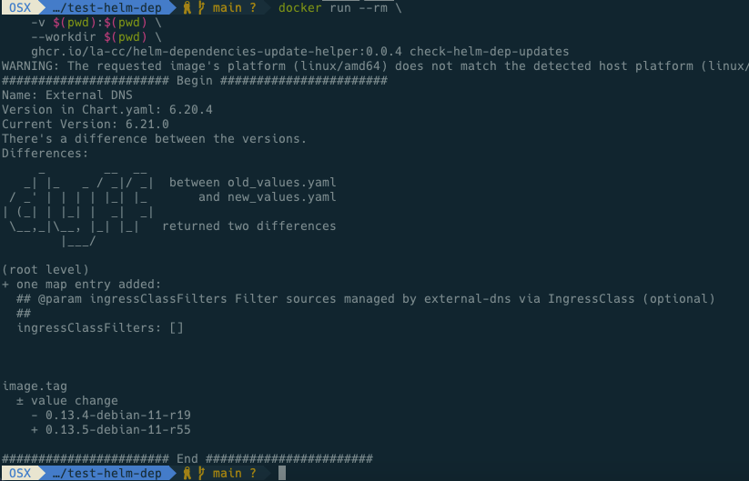
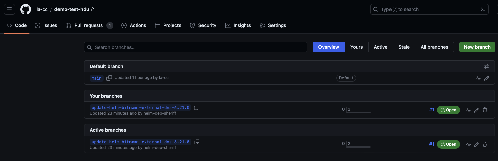
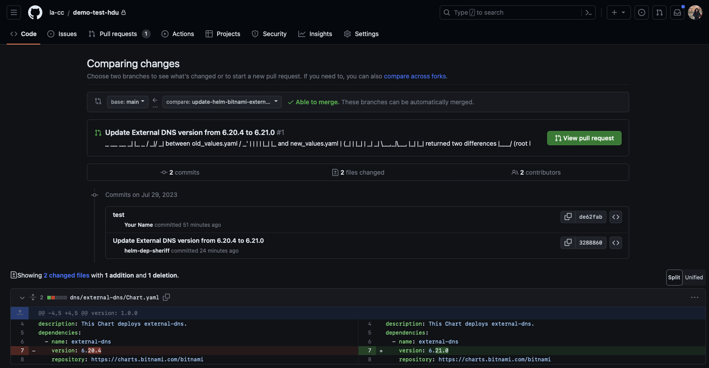
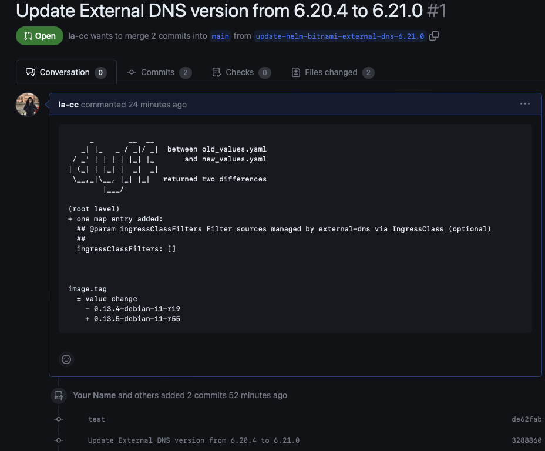
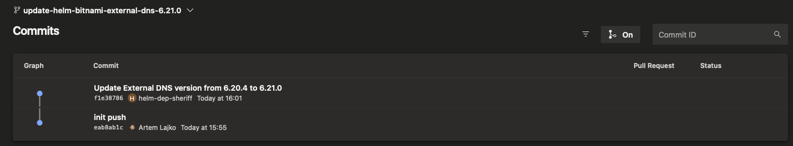
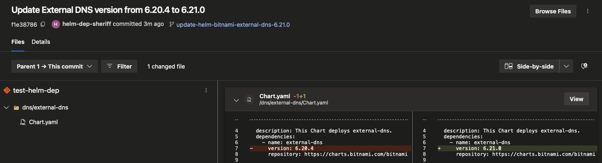
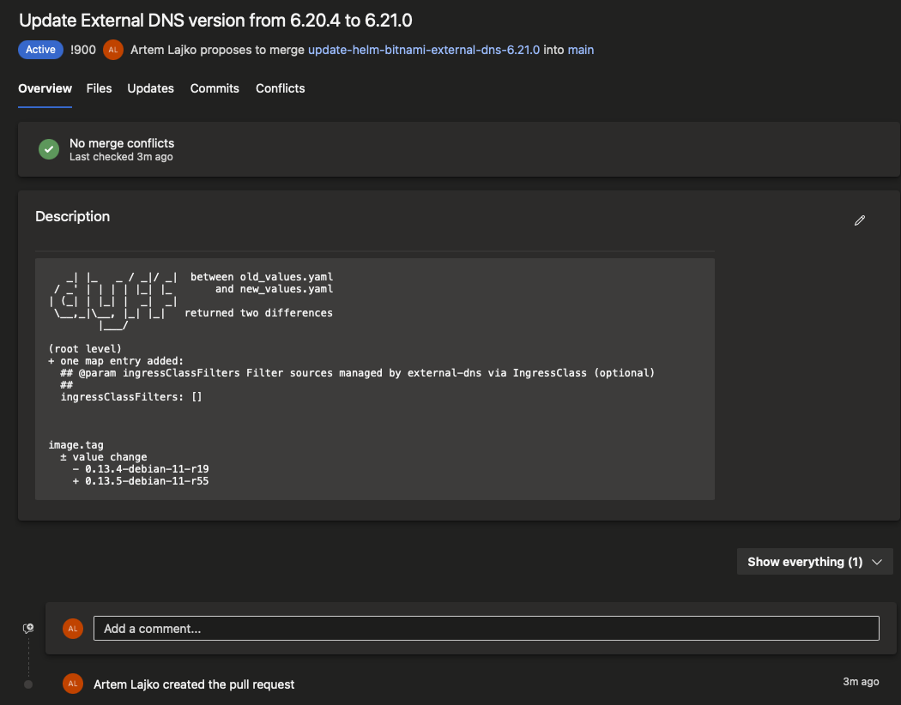

# Helm Dependencies Update Helper (Tool)

This is a tool to help you to update your helm dependencies in your helm charts. It will create a PR with the changes if you want to. But

Why I build this tool? We have a lot of helm charts and we want to update the dependencies in all of them.
The resources from helm-charts will be deployed over argocd, so the helm chart will no be installed on the cluster itself.
Because of that you cant use tools like [renovate](https://github.com/renovatebot/helm-charts) or [dependabot](https://github.com/dependabot).

You can use this tool in your CI/CD pipeline or locally. The whole description about the script can be found on TBD.

## Requirements

You will need container runtime engine like docker or podman. I will use docker in the following examples.

## Dry-Run

    docker run --rm \
    -v $(pwd):$(pwd) \
    --workdir $(pwd) \
    ghcr.io/la-cc/helm-dependencies-update-helper:0.0.5 init-config

    docker run --rm \
        -v $(pwd):$(pwd) \
        --workdir $(pwd) \
        ghcr.io/la-cc/helm-dependencies-update-helper:0.0.5 check-helm-dep-updates

You will get an output like:

## GitHub

First you have to login against GitHub. You can do this with `gh auth login` or get more information here on the official [documentation](https://cli.github.com/manual/gh_auth_login)

    docker run --rm \
        -v $(pwd):$(pwd) \
        -v ${HOME}/.ssh:/root/.ssh \
        -e GH_TOKEN=$(gh auth token) \
        --workdir $(pwd) \
        ghcr.io/la-cc/helm-dependencies-update-helper:0.0.5 init-config

Now edit the `config.env` file like:

    BRANCH='main'
    DRY_RUN='false'
    GITHUB='true'
    AZURE_DEVOPS='false'
    WITHOUT_PR='false'
    BOT_NAME='bot-helm-dep-sheriff'
    BOT_EMAIL='@la-cc.com'

Commit and push the changes to your repository. After that you can run the script with:

**WARNING:** after you set GITHUB to true, the script will create a new branch and a PR with the changes. If you want to test it first, set DRY_RUN to true.

    docker run --rm \
        -v $(pwd):$(pwd) \
        -v ${HOME}/.ssh:/root/.ssh \
        -e GH_TOKEN=$(gh auth token) \
        --workdir $(pwd) \
        ghcr.io/la-cc/helm-dependencies-update-helper:0.0.5 check-helm-dep-updates

You will get an output like:

## Azure DevOps

First you have to create a PAT token. You can find more information here on the official [documentation](https://docs.microsoft.com/en-us/azure/devops/organizations/accounts/use-personal-access-tokens-to-authenticate?view=azure-devops&tabs=preview-page). After you created the PAT token, you have to store it in a file called `pat_token.txt` in the root of your repository.

    docker run --rm \
        -v $(pwd):$(pwd) \
        -v ${HOME}/.ssh:/root/.ssh \
        -e AZURE_DEVOPS_EXT_PAT=$(cat pat_token.txt) \
        --workdir $(pwd) \
        ghcr.io/la-cc/helm-dependencies-update-helper:0.0.5 init-config

Now edit the `config.env` file like:

    BRANCH='main'
    DRY_RUN='false'
    GITHUB='false'
    AZURE_DEVOPS='true'
    WITHOUT_PR='false'
    BOT_NAME='bot-helm-dep-sheriff'
    BOT_EMAIL='@la-cc.com'

Commit and push the changes to your repository. After that you can run the script with:

**WARNING:** after you set AZURE_DEVOPS to true, the script will create a new branch and a PR with the changes. If you want to test it first, set DRY_RUN to true.

    docker run --rm \
        -v $(pwd):$(pwd) \
        -v ${HOME}/.ssh:/root/.ssh \
        -e AZURE_DEVOPS_EXT_PAT=$(cat pat_token.txt) \
        --workdir $(pwd) \
        ghcr.io/la-cc/helm-dependencies-update-helper:0.0.5 check-helm-dep-updates

You will get an output like:

## Without PR - Support all Git Providers

This part allows you to update the helm dependencies without creating a PR. You can use this part in your CI/CD pipeline.
It can be useful if you want to update the helm dependencies in your main branch over an manual pull request.

    docker run --rm \
        -v $(pwd):$(pwd) \
        -v ${HOME}/.ssh:/root/.ssh \
        --workdir $(pwd) \
        ghcr.io/la-cc/helm-dependencies-update-helper:0.0.5 init-config

Now edit the `config.env` file like:

    BRANCH='main'
    DRY_RUN='false'
    GITHUB='false'
    AZURE_DEVOPS='false'
    WITHOUT_PR='true'
    BOT_NAME='bot-helm-dep-sheriff'
    BOT_EMAIL='@la-cc.com'

Commit and push the changes to your repository. After that you can run the script with:

**WARNING:** after you set WITHOUT_PR to true, the script will create a new branch and push this branch. If you want to test it first, set DRY_RUN to true.

    docker run --rm \
        -v $(pwd):$(pwd) \
        -v ${HOME}/.ssh:/root/.ssh \
        --workdir $(pwd) \
        ghcr.io/la-cc/helm-dependencies-update-helper:0.0.5 check-helm-dep-updates
